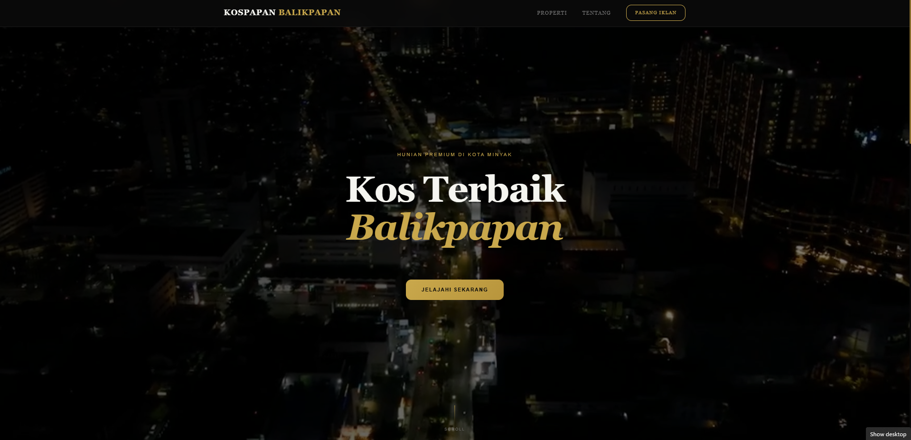
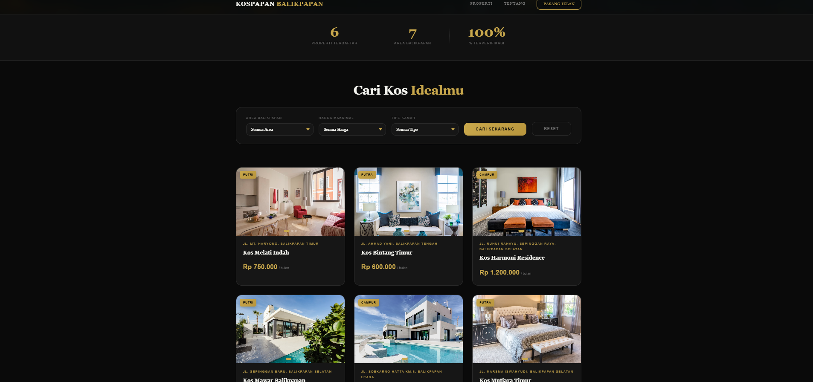
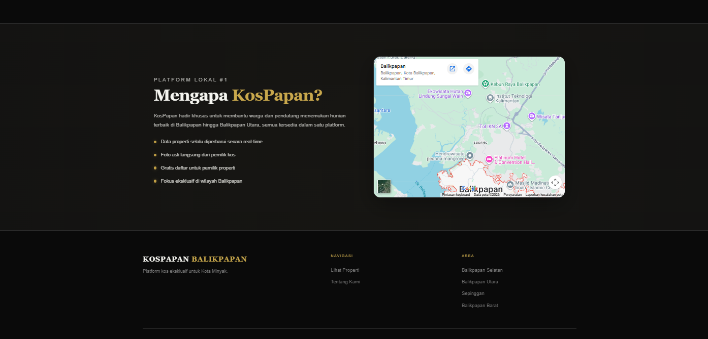

# 🏠 KosPapan Balikpapan

**KosPapan Balikpapan** adalah platform web untuk mencari dan menemukan kos (kamar sewa) terbaik di Kota Balikpapan. Website ini menyajikan daftar properti kos lengkap dengan foto, lokasi, harga, dan fitur pencarian/filter agar pengguna dapat menemukan hunian yang sesuai dengan kebutuhan mereka.

> *"Hunian Premium di Kota Minyak"* — Platform lokal #1 untuk pencarian kos eksklusif di wilayah Balikpapan.

## 🖼️ Preview

**Hero Section**


**Listing & Pencarian Properti**


**Tentang & Peta Lokasi**


## ✨ Fitur Utama

- 🎬 **Hero Section dengan Video Background** — Tampilan awal yang elegan dengan video latar kota Balikpapan
- 🔍 **Pencarian & Filter Kos** — Filter berdasarkan area, harga maksimal, dan tipe kamar (Putra/Putri/Campur)
- 🏘️ **Listing Properti** — Menampilkan kartu properti lengkap dengan foto, lokasi, kategori, dan harga sewa per bulan
- 📊 **Statistik Platform** — Menampilkan jumlah properti terdaftar, area cakupan, dan persentase properti terverifikasi
- 🗺️ **Peta Lokasi Interaktif** — Menampilkan cakupan wilayah layanan di Balikpapan
- 💡 **Modal & Lightbox** — Menampilkan detail properti dan galeri foto secara interaktif
- 🔔 **Toast Notification** — Notifikasi untuk aksi pengguna (contoh: pencarian, filter, dll.)
- 📱 **Responsive Design** — Tampilan optimal di berbagai ukuran layar (desktop, tablet, mobile)
- ⚡ **Skeleton Loading** — Efek loading placeholder saat data properti dimuat
- 🎞️ **Animasi Halus** — Transisi dan animasi UI untuk pengalaman pengguna yang lebih hidup

## 🗂️ Struktur Proyek

```
PEMSTRUK-PROJECT/
├── .vscode/
├── css/
│   ├── about.css
│   ├── base.css
│   ├── buttons.css
│   ├── filter.css
│   ├── footer.css
│   ├── hero.css
│   ├── lightbox.css
│   ├── listing.css
│   ├── modal.css
│   ├── navbar.css
│   ├── responsive.css
│   ├── skeleton.css
│   ├── stats.css
│   └── toast.css
├── js/
│   ├── animation.js
│   ├── app.js
│   ├── cards.js
│   ├── config.js
│   ├── data.js
│   ├── filter.js
│   ├── helpers.js
│   ├── lightbox.js
│   ├── modal.js
│   └── state.js
├── video/
│   └── kosss-video.mp4
├── index.html
└── main.css
```

## 🛠️ Teknologi yang Digunakan

- **HTML5** — Struktur konten halaman
- **CSS3** — Styling modular, dipecah per komponen (navbar, hero, listing, filter, modal, lightbox, footer, dll.) agar mudah dikelola dan dikembangkan
- **JavaScript (Vanilla JS)** — Logika interaktif, dipisah berdasarkan tanggung jawab masing-masing modul:
  - `app.js` — Entry point utama aplikasi
  - `config.js` — Konfigurasi global aplikasi
  - `data.js` — Sumber data properti kos
  - `state.js` — Manajemen state aplikasi
  - `cards.js` — Render kartu properti
  - `filter.js` — Logika pencarian & filter
  - `modal.js` & `lightbox.js` — Interaksi popup detail & galeri
  - `animation.js` — Efek animasi UI
  - `helpers.js` — Fungsi bantu (utility functions)

## 📂 Section Halaman

| Section | Deskripsi |
|---|---|
| **Navbar** | Navigasi utama: Properti, Tentang, Pasang Iklan |
| **Hero** | Judul utama dengan video latar dan CTA "Jelajahi Sekarang" |
| **Stats** | Statistik jumlah properti, area, dan tingkat verifikasi |
| **Filter/Listing** | Form pencarian kos berdasarkan area, harga, dan tipe kamar, serta daftar kartu properti |
| **About** | Penjelasan mengenai keunggulan platform KosPapan |
| **Footer** | Informasi navigasi tambahan dan daftar area cakupan layanan |

## 🚀 Cara Menjalankan

1. Clone repository ini
   ```bash
   git clone https://github.com/username/PEMSTRUK-PROJECT.git
   ```
2. Masuk ke folder proyek
   ```bash
   cd PEMSTRUK-PROJECT
   ```
3. Buka file `index.html` di browser, atau jalankan menggunakan ekstensi **Live Server** pada VS Code untuk hasil terbaik

## 🌆 Cakupan Area

Platform ini berfokus secara eksklusif melayani pencarian kos di wilayah:
- Balikpapan Selatan
- Balikpapan Utara
- Balikpapan Barat
- Sepinggan

## 📌 Catatan Pengembangan

Proyek ini dikembangkan dengan struktur kode yang modular—setiap file CSS dan JavaScript merepresentasikan satu komponen atau fungsi tertentu—guna memudahkan proses maintenance dan pengembangan fitur lanjutan di masa mendatang.

## 🤝 Kontribusi

Kontribusi, saran, dan masukan sangat terbuka. Silakan buat *pull request* atau buka *issue* baru jika menemukan bug atau memiliki ide pengembangan.

---
